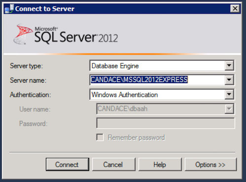
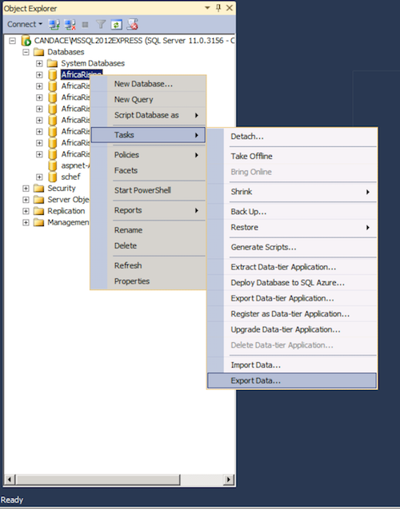
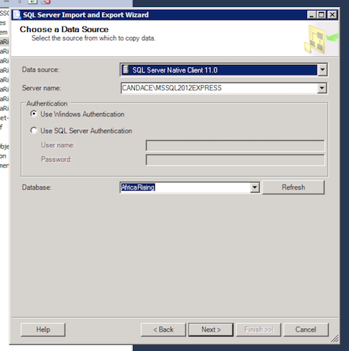
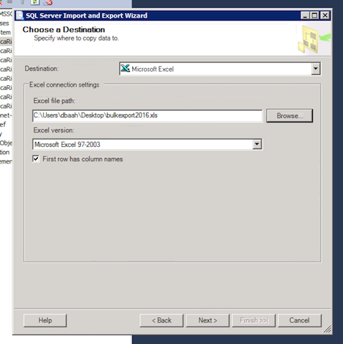
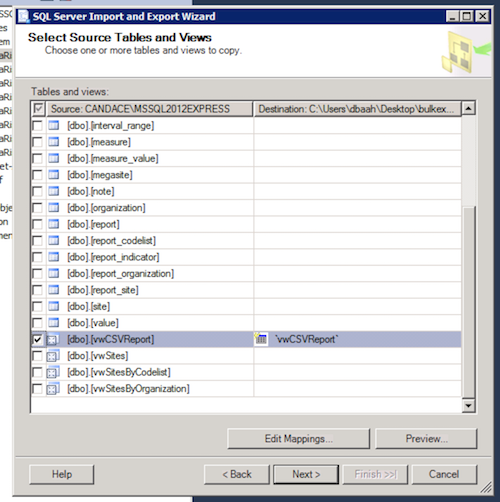
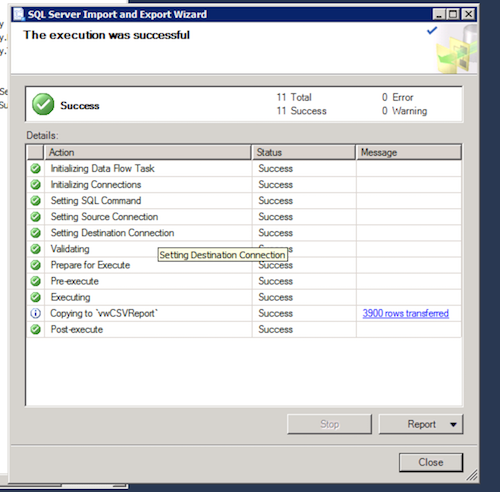

# ar pmmt bulk export ftf data reports

This outlines the process of bulk exporting Africa Rising FtF data reports from Microsoft SQL Server Management Studio

#### Export Data via SQL Server Management Studio
  - Open up SQL Server Management Studio & Connect to CANDACE\MSSQL2012EXPRESS
  
  
  
  - Using the Object Explorer, right click the AfricaRising production database, Select "Tasks" & then "Export Data..." This opens up the Import & Export Wizard.
  
  
  
  - Select "Next" to chose your Data Source. In this case, our source is the **_AfricaRising_** production database. These should be the default settings:
  
  

  - Select "Next" to chose your Data Destination. In the Destination drop down list, Select "Microsoft Excel" and chose a file path. This is where your data will be exported to.
  
  
  
  - On the next screen, Select the radio button, "Copy data from one of more tables or views" & hit "Next"
  
  - We want to pull data from the view **_vwCSVReport_**
  
  
  
  - Use the default settings for the Next two screen, and Select "Finish"
  
  
  
  - Complete! Your data export should be located in file path provided in step 4
